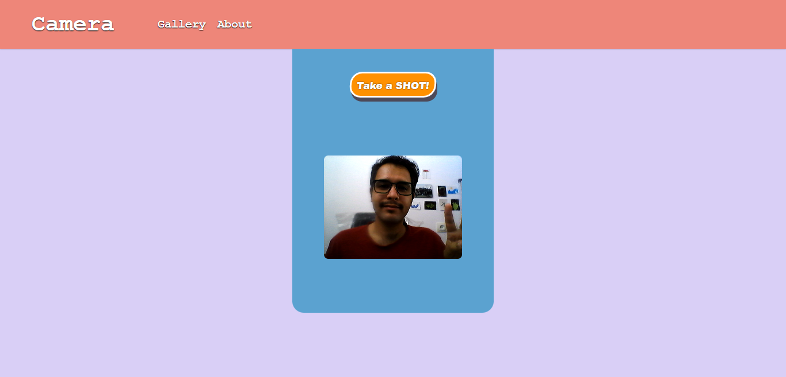
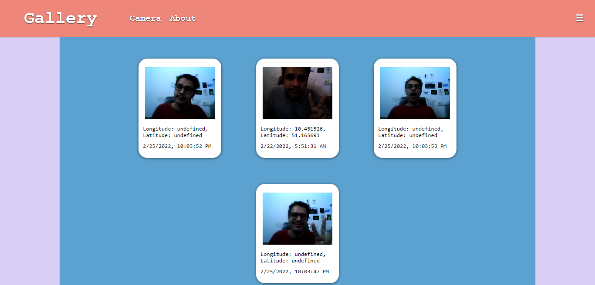
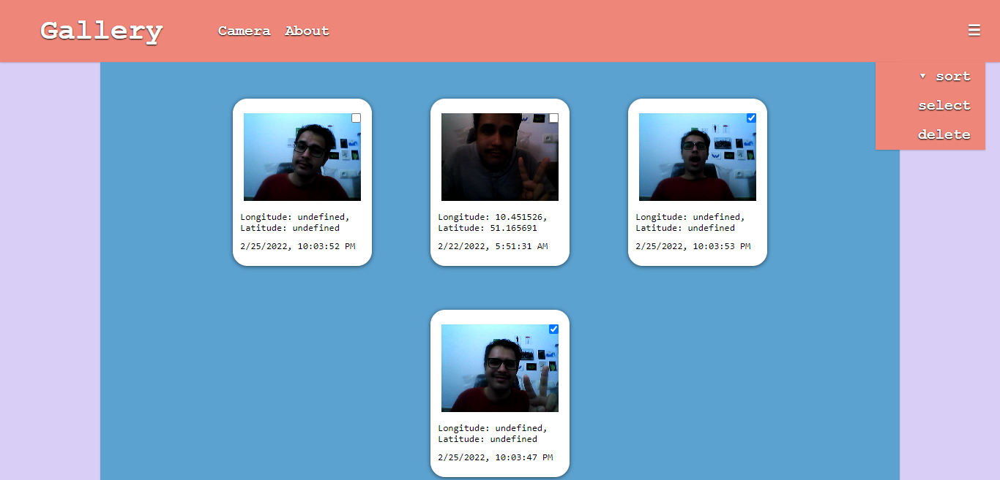

# Little Selfie App
> The idea for this app came from Joey Lee's app, called Data Selfie App. But it has more functions! 
> Here I am is a little web application that allows you to submit an image of your self along with your geolocation. This app is a nice starting point for other self-tracking applications or just a standalone application to create a collection of "dataselfies" with some extra metadata.




## Setup
1. Clone this repo in your local dir.

2. Head to repo dir, then in your terminal:
```sh
npm install
```

3. then start your server
```sh
npm start
```
or if in development: `npm run dev`

Go to: `localhost:4085` to take a SHOT!

## Features

- Sort items in gallery based on time
- Delete items

## Features (coming soon)

- Add more info about selfie
- Authentication and login
- querying other APIs (e.g. weather)


## Gallery





